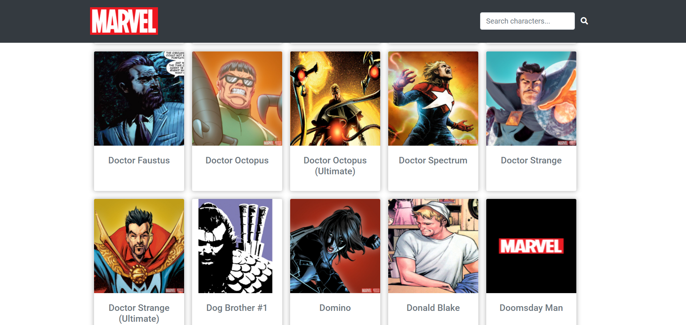

<div align="center">
    
</div>

# Marvel App | front-end

Front-end of Marvel application - SPA connected with a back-end developed using data and routes obtained by the official [Marvel Comics API](https://developer.marvel.com/docs). Project developed for a challenge during studies at Growdev.

You can also [click here](https://github.com/cunhasbia/marvel-backend) to go to the **back-end** repository of this application. Run both projects together.

<div align="center">
    
</div>
<hr> 

## :computer: Functionalities
✔️ A homepage with the **character list** and pagination;<br>
✔️ Input to **search** by character name;<br>
✔️ Clicking on a character displays a **page with details** (name, description and comics info) in SPA format;<br>
✔️ Button on the character details page to **back to homepage**;<br>
✔️ If the character has **no image**: displays the Marvel logo;<br>
✔️ If the character has **no description**: displays the text "description not informed".

## :woman_technologist: Technologies and tools used

- HTML
- CSS
- Bootstrap
- Javascript ES6+
- Yarn
- Axios
- Webpack | Babel

## ▶️ How to run the project?

Before start, install [Git](https://git-scm.com) in your machine. Moreover, recommend use the [VSCode](https://code.visualstudio.com/) terminal.

```bash
# Clone this repository
$ git clone https://github.com/cunhasbia/marvel-frontend.git

# Access the repository on your terminal
$ cd marvel-frontend

# Install dependencies
$ yarn install

# Run
$ yarn dev
```
<hr>

Made with :orange_heart: by Bianca Cunha
